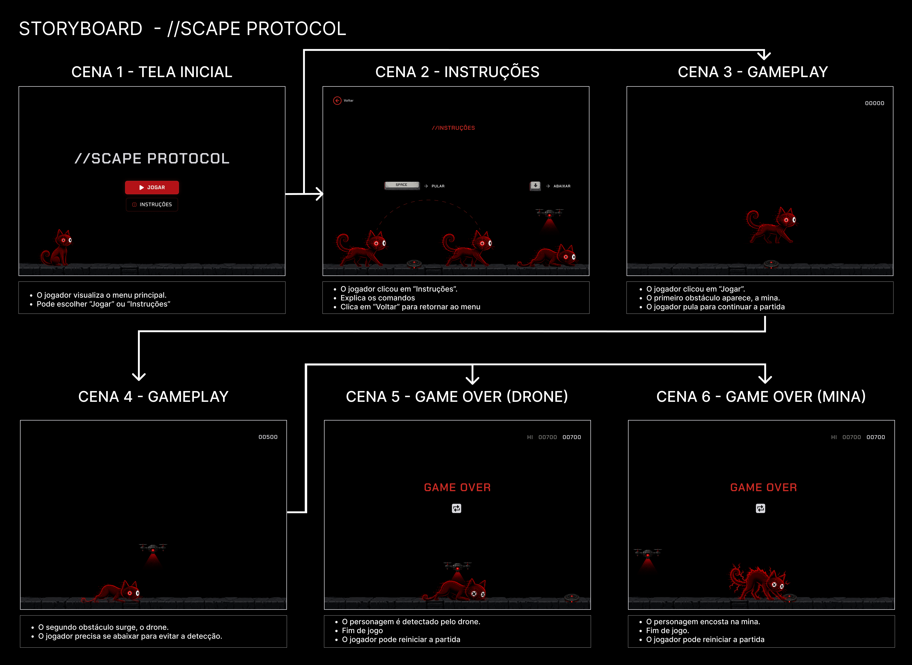

# //scape protocol

Minijogo de reflexos criado como parte da divulgação do [Falkron](https://falkron.com.br), inspirado no clássico jogo do dinossauro do Chrome.

Enquanto o Falkron ainda está em desenvolvimento, o **//scape protocol** funciona como uma forma divertida de entreter quem visita a holding page do projeto.

🎮 **Jogue agora:** [falkron.com.br/scape-protocol](https://falkron.com.br)

## Sobre o jogo

Você controla o mascote do Falkron (um gato) fugindo de obstáculos que aparecem no caminho. O objetivo é sobreviver o máximo de tempo possível, desviando ou pulando dos perigos.

## Processo de criação

A ideia do jogo nasceu em um trabalho da disciplina de Interface Homem-Máquina da faculdade. Abaixo está o storyboard original usado no planejamento:

> O design final do mascote passou por pequenos ajustes em relação ao storyboard original.

## Tecnologias

- HTML
- CSS
- JavaScript

## Contexto

Este jogo nasceu junto com a holding page do Falkron, em `falkron.com.br`, como um convite para quem chega no site enquanto a aplicação principal ainda está sendo construída.

## Licença

Todos os direitos reservados.
